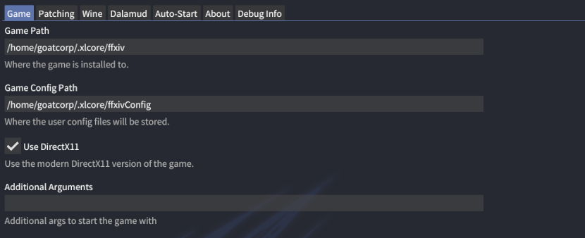

# XIVLauncher FAQ (Linux)

If you're looking for the Steam Deck FAQ, please see [this page](steamdeck.md).

## Table of Contents

### Info

- [How do I disable autologin?](#q-how-do-i-disable-autologin)
- [Are XIVLauncher, Dalamud, and Dalamud Plugins safe to use?](#q-are-xivlauncher-dalamud-and-dalamud-plugins-safe-to-use)
- [Where can I find my FFXIV installation?](#q-where-can-i-find-my-ffxiv-installation)
- [Can I repair my FFXIV installation?](#q-can-i-repair-my-ffxiv-installation)
- [How do I uninstall XIVLauncher?](#q-how-do-i-uninstall-xivlauncher)
- [How do I migrate FFXIV and/or XIVLauncher files from an old Wine prefix to a new one?](#q-how-do-i-migrate-ffxiv-andor-xivlauncher-files-from-an-old-wine-prefix-to-a-new-one)
- [How do I migrate FFXIV and/or XIVLauncher files from Lutris to the native XIVLauncher?](#q-how-do-i-migrate-ffxiv-andor-xivlauncher-files-from-lutris-to-the-native-xivlauncher)
- [Will plugins/XIVLauncher work on patch day?](#q-will-pluginsxivlauncher-work-on-patch-day)
- [CAN I LOGIN EARLY TO TITLESCREEN BEFORE PATCH LIVE????](#q-can-i-login-early-to-titlescreen-before-patch-live)
- [Why do people keep asking about Steam so much?](#q-why-do-people-keep-asking-about-steam-so-much)

### Troubleshooting

- [How can I fix crashes on startup?](#q-how-can-i-fix-crashes-on-startup)
- [I keep getting "XIVLauncher failed to update" errors](#q-i-keep-getting-xivlauncher-failed-to-update-errors)
- [How come the in-game addon \(Dalamud\) doesn't work and/or plugins don't display?](#q-how-come-the-in-game-addon-dalamud-doesnt-work-andor-plugins-dont-display)
- [XIVLauncher isn't saving my new password / how do I clear my saved password?](#q-xivlauncher-isnt-saving-my-new-password--how-do-i-clear-my-saved-password)
- [How do I fix a version check error when trying to update FFXIV?](#q-how-do-i-fix-a-version-check-error-when-trying-to-update-ffxiv)
- [The official launcher isn't working / XIVLauncher failed to check for updates / Patch files could not be verified](#q-the-official-launcher-isnt-working--xivlauncher-failed-to-check-for-updates--patch-files-could-not-be-verified)

### Misc

- [My Gamemode/MangoHud stopped working after I installed ACT](#my-gamemodemangohud-stopped-working-after-i-installed-act)


---

### Q: How do I disable autologin?

Keep the shift key held down while you open XIVLauncher. Keep it held down until the main window appears.

---

### Q: Are XIVLauncher, Dalamud, and Dalamud Plugins safe to use?

Yes! Here at Goatcorp, we take security extremely seriously. Using our software should never put you in a situation where another player can detect you're using third party modifications. At this time, we have no reason to believe that Square Enix does anything to detect client modifications in any form. Compare to using ReShade/GShade, ACT, Teamcraft, and other community projects. If you'd like to know more about XIVLauncher's security, [see this page.](security.md)

#### General Disclaimer

You shouldn't mention using XIVLauncher or plugins in-game, just like you shouldn't admit to using *any* third party modifications, as it is technically against the FFXIV Terms of Service. We have no reported cases of a user being banned for using XIVLauncher, Dalamud, or Dalamud plugins, but you should still exercise caution. All officially supported plugins go through code review to ensure that they are not exploiting the game or doing anything in such a manner that would result in your game client sending invalid data to the game servers. **We cannot endorse any unofficial plugins from third party plugin repositories. You use those at your own risk.**

Additionally, XIVLauncher is entirely a **hobby project**. We do this because it's fun to us, and not because we get paid for it. This means that we always try our best to be professional and responsive, but it also means that everything we do provide to you is on a "best effort" basis - maintaining software like this takes a lot of time and we're just human as well :)

If you have any questions about XIVLauncher, Dalamud, or Dalamud Plugins, please feel free to ask questions in our [Discord server](https://goat.place/). We are a primarily English-speaking community and support in other languages may be limited.

---

### Q: Where can I find my FFXIV installation?

(AKA: What does XIVLauncher mean by "game path"?)

FFXIV installs to a different locations depending on whether you used the official installer, whether you used the Linux-native or Lutris XIVLauncher, and potentially if you installed the free trial or not. Here are some of the common paths.

Whatever you do, DO NOT SELECT THE `boot` OR `game` FOLDER. But if you already have a copy of FFXIV installed, you'll want the folder that contains them.

Steam:

- `~/.local/share/Steam/steamapps/common/FINAL FANTASY XIV Online`
- `~/.local/share/Steam/steamapps/common/FINAL FANTASY XIV - A Realm Reborn`\
  **NOTE**: If your steam library is on another drive, it will have a different, but similar structure.

Lutris:

- `~/Games/final-fantasy-xiv-online`

XLCore (Native):

- `~/.xlcore/ffxiv`



---

### Q: Can I repair my FFXIV installation?

Yes! Right click `Log in` in XIVLauncher and select `Repair game files`.

**DO NOT USE THE REPAIR FEATURE IN THE OFFICIAL LAUNCHER!** It will delete your entire game installation and redownload it.

---

### Q: How do I uninstall XIVLauncher?

If you are running the **native version of XIVLauncher**, you can uninstall it by removing the `~/.xlcore` directory. Your file explorer may hide the folder by default, so if you don't see it you can either toggle visibility for hidden folders or remove it with terminal (if comfortable).

If you are running the **Flatpak version of XIVLauncher**, you can run `flatpak uninstall dev.goats.xivlauncher` to remove it.

If you are running the **Lutris version of XIVLauncher**, removing the XIVLauncher from the library should present you with an option to delete all files.

---

### Q: How do I migrate FFXIV and/or XIVLauncher files from an old Wine prefix to a new one?

Once you've made your new XIVLauncher-based prefix, you can copy files from your old ffxiv prefix for the following:

#### Copy a FFXIV Install from one prefix to another (or move/symlink as desired)

- Copy from: `~/Games/<old prefix>/drive_c/Program Files (x86)/SquareEnix/FINAL FANTASY XIV - A Realm Reborn`
- Copy to: `~/Games/<new prefix>/drive_c/Program Files (x86)/SquareEnix/FINAL FANTASY XIV - A Realm Reborn`

#### Copy your user/character settings

- Copy from: `~/Games/<old prefix>/drive_c/users/<username>/My Documents/My Games/FINAL FANTASY XIV - A Realm Reborn`
- Copy to:
  - (Wine 5) `~/Games/<new prefix>/drive_c/users/<username>/My Documents/My Games/FINAL FANTASY XIV - A Realm Reborn`
  - (Wine 6) `~/Games/<new prefix>/drive_c/users/<username>/Documents/My Games/FINAL FANTASY XIV - A Realm Reborn`

#### Copy XIVLauncher config (please reinstall your plugins)

- Copy from: `~/Games/<old prefix>/drive_c/users/<username>/Application Data/XIVLauncher/pluginConfigs`
- Copy to:
  - (Wine 5) `~/Games/<new prefix>/drive_c/users/<username>/Application Data/XIVLauncher/pluginConfigs`
  - (Wine 6) `~/Games/<new prefix>/drive_c/users/<username>/AppData/Roaming/XIVLauncher/pluginConfigs`

---

### Q: How do I migrate FFXIV and/or XIVLauncher files from Lutris to the native XIVLauncher?

You can either move your files entirely or link your files if you wish to continue using Lutris.

#### Move or Link an FFXIV Install

**Move:** For the game itself, move both the `game` and `boot` folder from their previous location to `/.xlcore/ffxiv`. This folder may not exist if you have not launcher the client at least once.\
**Link:** Remove the `~/.xlcore/ffxiv` folder, then run `ln -s <path/to/folder/containing/game/and/boot> ~/.xlcore/ffxiv`

#### Move or link Config settings

**Move:** Move the files in `<YOURWINEPREFIX>/drive_c/users/<username>/AppData/Roaming/XIVLauncher/pluginConfigs` to `~/.xlcore/pluginConfigs`\
**Link:** Remove the `~/.xlcore/pluginConfigs` folder, then run `ln -s <YOURWINEPREFIX>/drive_c/users/<username>/AppData/Roaming/XIVLauncher/pluginConfigs ~/.xlcore/pluginConfigs`

#### Move or Map your user / character settings

**Move:** Move the files in`<YOURWINEPREFIX>/drive_c/users/<username>/My Documents/My Games/FINAL FANTASY XIV - A Realm Reborn` to `~/.xlcore/ffxivConfig`\
**Link:** Remove the `~/.xlcore/ffxivConfig` folder, then run `ln -s "<YOURWINEPREFIX>/drive_c/users/<username>/My Documents/My Games/FINAL FANTASY XIV - A Realm Reborn" ~/.xlcore/ffxivConfig`

---

### Q: Will plugins/XIVLauncher work on patch day?

Please remember that many of the developers have school/jobs/both and live across a variety of time zones. Things will be updated when they can be. The notion that "XL could be gone at any time" still exists. **We have no clue how much work/time any possible patch may take and we can't give you any ETAs - it's impossible.** Please don't badger us about it, the more support we have to do on patch days, the less work we can do to fix things.

XIVLauncher:

- Users do not need to take any preemptive actions for XIVLauncher compatibility with a new patch.
- Unless SE decides to completely change how authentication or patch download/updating works, the launcher will work just fine on patch days.

Dalamud:

- Dalamud has an internal mechanism that checks the client version and a whitelisted compatibility file.
- If the client version does not match what's whitelisted, Dalamud will not load.
- Once Dalamud has been whitelisted, it will load the next time you launch with XIVLauncher. (We'll also make an announcement on Discord)
- Dalamud may or may not require updates to be made compatible with the current client. This ultimately depends on how much changed internally and we cannot provide any estimates on how long it may take to whitelist as compatible.

Plugins:

- Expect all plugins to stop working every patch.
- Once Dalamud has been whitelisted for a new patch, it will try to load plugins.
- It's entirely possible that a patch will be fine for Dalamud, but break a plugin. (If this happens, you'll want to disable/remove the plugin until it's updated)

---

### Q: CAN I LOGIN EARLY TO TITLESCREEN BEFORE PATCH LIVE????

In theory, yes. But you'll probably have expired authorization and have to login again anyways.

Like every patch maintenance, the lobby server will likely be taken offline as usual. Even assuming you get the patch downloaded and applied mid-maintenance, your authorization will almost assuredly be expired before things are back up.  **Especially for housing patches as SE never ends those early.**

You can make use of XL's "wait for maintenance to be over" features to sit and check for boot patches (no login required) and then prompt you to login for game patches as soon as they are generally available.

The "wait for maintenance to be over" feature can also check for servers to be live every ~15 seconds to get you logged in as soon as things are live.

As with any patch, **in-game addons will be automatically disabled until Dalamud is updated for new patch content**. Do not manually inject Dalamud as a startup application unless you'd like to crash your client!

---

### Q: How do I fix a version check error when trying to update FFXIV?

1. Go to `(your user folder)\Documents\My Games\FINAL FANTASY XIV - A Realm Reborn`.
2. Open the `FFXIV_BOOT.cfg` file in your text editor of choice.
3. Change `BootVersionCheckMode` to `1`.
4. Relaunch.

---

### Q: Why do people keep asking about Steam so much?

People who bought FFXIV on Steam are required to link their Steam account to their Square Enix account in the official launcher. We have no way around this, and because of this, you are required to have Steam open if you have a Steam service account.

Your Steam installation also needs to be signed into the correct account.

If you want the Steam overlay on a non-Steam service account, you need to add XIVLauncher as a non-Steam game through Steam.

---

### Q: How can I fix crashes on startup?

Please try wiping your WINE prefix (**make sure you save any data you have manually put in there**). The next time XIVLauncher attempts to launch the game it will recreate the WINE prefix to run the game.

You can delete your WINE prefix by removing the `~/.xlcore/wineprefix` folder

If you are still facing issues, please join our [Discord server](https://goat.place/).

---

### Q: I keep getting "XIVLauncher failed to update" errors

There are a few different reasons that XIVLauncher will fail to open. Here are a few common ones.

#### XIVLauncher updates are breaking due to security settings
On some more recent Linux distributions, TLS 1.0 and 1.1 has been disabled. This causes an issue with WINE and FFXIV/XIVLauncher because it may not always negotiate TLS correctly.

You can fix this by setting your `dssenh` DLL override to native if it isn't already. (`dssenh=n` as an environment variable or in Lutris.)

\
(Thank you to kainz0r for this tip!)

On **Fedora**? You will need to run `sudo update-crypto-policies --set DEFAULT:FEDORA32` in order to lighten up the security policies as Fedora 33 and later have stricter SSL/TLS settings.\
`FEDORA32` didn't work? Try instead: `sudo update-crypto-policies --set LEGACY`

#### GitHub Rate Limits

If you've made a lot of queries to GitHub recently, it's possible they may have rate-limited you. This is usually a combined effort of XIVLauncher, Dalamud, Dalamud plugin updates, GShade, etc. all being done in rapid succession, which shouldn't happen under normal circumstances.

1. Try to visit <https://api.github.com/rate_limit> and see if the post loads (or downloads a JSON file).
2. Look for `resources.core.remaining`. If it's 0, you've hit GitHub's rate limit.
3. If you've hit the limit, grab the timestamp number from resources.core.reset and convert the UTC timestamp into a human-readable date. [unixtimestamp.com](https://www.unixtimestamp.com/) works great for this.
4. Wait the alloted time before launching again, or the timeout period could be extended (if you absolutely need to get in game, use the official launcher during this time).

---

### Q: How come the in-game addon (Dalamud) doesn't work and/or plugins don't display?

Like many other game tools, Dalamud works by injecting into the FFXIV process and hooking DirectX. You may find that Dalamud has stopped working do to environmental changes.

If your Dalamud is failing to inject, here are some places to start troubleshooting:

- **WINE Prefix**: If you've made modifications to your WINE prefix, those changes may interfere with Dalamud. We'd recommend undoing recent changes if possible. As a last resort you can remove your `~/.xlcore/wineprefix` directory and let it rebuild next launch.
- **Custom WINE**: If you're using a custom WINE setup rather than the managed WINE-XIV we provide, make sure the WINE version and Prefix do not have any issues with dotnet5/6.
- **Inconsistent ENV**: All programs launched in your WINE enviroment need the same ENV (especially FSync, if enabled) to work correctly. If you're using a custom WINE setup verify everything is launching as expected.

If you still cannot get Dalamud to launch, please join our [Discord server](https://goat.place/) and post these logs in the Linux support channel.

**WINE**\
`~/.xlcore/logs/wine.log`

**Dalamud**\
`~/.xlcore/dalamud.log`\
`~/.xlcore/dalamud.injector.log`

---

### Q: XIVLauncher isn't saving my new password / how do I clear my saved password?

XIVLauncher utilizes libsecrets providers to store your password. You will need `libsecret` installed, as well as one of the following providers

- Gnome-Keyring \(Seahorse is optional\)
- lxqt\_wallet
- KeepassXC

If you would prefer not to use a libsecret provider, you can set the following ENV to tell XIVLauncher to use a file:\
**Note: We advise against using this option as it will store your password in plaintext.**

`XL_SECRET_PROVIDER=FILE`

---

### Q: The official launcher isn't working / XIVLauncher failed to check for updates / Patch files could not be verified

Most likely, there's an issue with your network connection or the route it's taken to Square Enix's servers and/or GitHub. The only information XIVLauncher really gets from this is "something went wrong" though.

While this usually is a per-household kinda thing, there's no guarantee that multiple computers in the same location would get load balanced onto the same servers (which is why one computer worked and another didn't).

If you're sure this isn't a firewall issue or a rate limit, here are some things you can try.

- Reboot the computer
- Reboot the network equipment (modem and router)
- Try different DNS
  - Google offers 8.8.8.8 and 8.8.4.4
  - CloudFlare offers 1.1.1.1 and 1.0.0.1
  - Level3 offers 4.2.2.2 and 4.2.2.4
- Try a VPN
  - If you already connect using a VPN, try disconnecting it first
  - If you want to try a free VPN service, Cloudflare offers one at <https://1.1.1.1/> or you can try [ProtonVPN](https://protonvpn.com/) for more control.
  - If you want to try a paid VPN service (still no guarantee) we've recommended [MUDFISH](https://mudfish.net) in the past.
- Copy a working FFXIV install from another computer
  - The easiest method is to just copy the folder onto a large flash drive or external HDD.
  - If you're familiar with setting up Windows Sharing, you can also share the drive/folder from a working computer and copy it over your network.

---

### I'm experiencing input issues and stuttering.

This is most likely cause by an input framework misfunctioning. You have two options to fix this:

1. In the game settings, enable `Limit mouse operation to game window` under System Settings -> Mouse Settings\
   **This will only fix input issues. If you have both, use the option below.**
2. Pass `XMODIFIERS="@im=null"` to the game to prevent input frameworks from working on the game window.\
   You may need to set the keyboard layout with the `setxkbmap` command if you're using a non-US layout.

(Special thank you to 3e849f2e5c for this fix.)

### My Gamemode/MangoHud stopped working after I installed ACT.

WINE will disable LD_PRELOAD if you use setcap on it. This is intentional and done for security reasons. You can fix it by doing the following:

**Gamemode:**
`patchelf --add-needed libgamemodeauto.so.0 /path/to/wine64/wine/wineserver`\
**MangoHud:**
`patchelf --add-needed libMangoHud.so /path/to/wine64/wine/wineserver`

(Special thank you to Kazumi for this fix.)

---

Want to add a new FAQ entry? Please use the template below and PR to the main [FAQ repo](https://github.com/goatcorp/faq):

```md
### Q: Basic Title

(FAQ content)

---
```

Then add it to the Table of Contents using `- [Name / Title here](#anchor here)`.

[Return to the top](#table-of-contents)\
[Return to the main FAQ](https://goatcorp.github.io/faq)