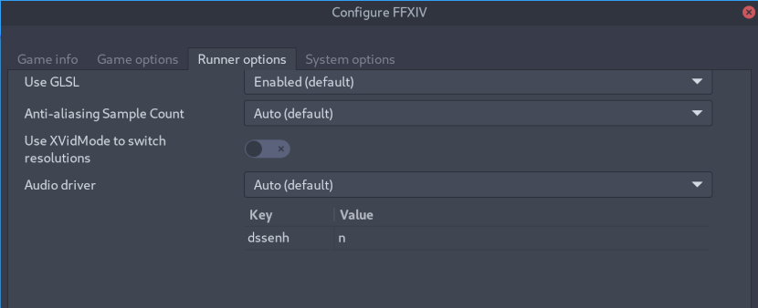
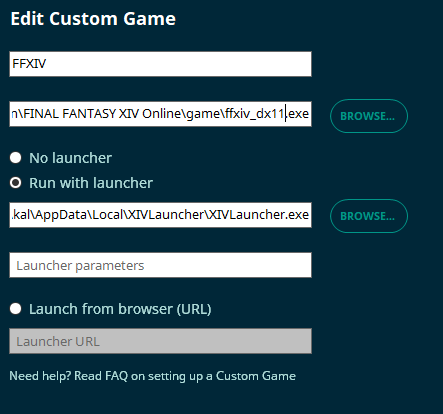

# XIVLauncher FAQ

### Table of Contents
[Are XIVLauncher, Dalamud, and Dalamud Plugins safe to use?](#q-are-xivlauncher-dalamud-and-dalamud-plugins-safe-to-use) <br>
[I get an error saying XIVLauncher failed to check for updates when I open the program](#q-i-get-an-error-saying-xivlauncher-failed-to-check-for-updates-when-i-open-the-program) <br>
[I'm on Linux and I keep getting \"XIVLauncher failed to update\" errors](#q-im-on-linux-and-i-keep-getting-xivlauncher-failed-to-update-errors) <br>
[How come the in-game addon \(Dalamud\) doesn't work and/or plugins don't display?](#q-how-come-the-in-game-addon-dalamud-doesnt-work-andor-plugins-dont-display) <br>
[How do I uninstall XIV Launcher?](#q-how-do-i-uninstall-xiv-launcher) <br>
[How do I fix plugins that rely on Dalamud provided opcodes?](#q-how-do-i-fix-plugins-that-rely-on-dalamud-provided-opcodes) <br>
[How do I whitelist XIVLauncher and Dalamud so my Antivirus leaves them alone](#q-how-do-i-whitelist-xivlauncher-and-dalamud-so-my-antivirus-leaves-them-alone) <br>
[XIV isn't saving my new password / how do I clear my saved password?](#q-xiv-isnt-saving-my-new-password--how-do-i-clear-my-saved-password) <br>
[I think XIVLauncher is giving me a Blue Screen of Death. What information would help narrow this down?](#q-i-think-xivlauncher-is-giving-me-a-blue-screen-of-death-what-information-would-help-narrow-this-down) <br>
[How can I fix crashes on startup?](#q-how-can-i-fix-crashes-on-startup) <br>
[Do not expect Dalamud and/or Plugins to work on updates/patch day releases.](#q-do-not-expect-dalamud-andor-plugins-to-work-on-updatespatch-day-releases) <br>
[CAN I LOGIN EARLY TO TITLESCREEN BEFORE PATCH LIVE????](#q-can-i-login-early-to-titlescreen-before-patch-live) <br>
[XL Environment Variables](#q-xl-environment-variables) <br>
[Outdated Plugins List](#q-outdated-plugins-list) <br>
[The launcher shows a red world icon and an error message when trying to log in, and the official launcher doesn't open](#q-the-launcher-shows-a-red-world-icon-and-an-error-message-when-trying-to-log-in-and-the-official-launcher-doesnt-open) <br>
[WTFast Config](#q-wtfast-config) <br>
[NVIDIA Driver issue \(7th of January\)](#q-nvidia-driver-issue-7th-of-january) <br>
[How to set an injection delay in rivaTuner/RTSS](#q-how-to-set-an-injection-delay-in-rivatunerrtss) <br>
[Where can I find my FFXIV Installation?](#q-where-can-i-find-my-ffxiv-installation) <br>
[How do I migrate ffxiv and/or xivlauncher files from an old Wine prefix to a new one? \[Linux\]](#q-how-do-i-migrate-ffxiv-andor-xivlauncher-files-from-an-old-wine-prefix-to-a-new-one-linux) <br>
[How do I migrate ffxiv and\\or xivlauncher files from an old installation to a new one? \[Windows\]](#q-how-do-i-migrate-ffxiv-andor-xivlauncher-files-from-an-old-installation-to-a-new-one-windows) <br>
[Why do people keep asking about Steam so much?](#q-why-do-people-keep-asking-about-steam-so-much) <br>
[Can I repair my FFXIV installation?](#q-can-i-repair-my-ffxiv-installation) <br>
[How do I fix a version check error when trying to update FFXIV?](#q-how-do-i-fix-a-version-check-error-when-trying-to-update-ffxiv) <br>
[I updated my game with TexTools mods installed. How do I fix crashes?](#q-i-updated-my-game-with-textools-mods-installed-how-do-i-fix-crashes) <br>
<hr>

### Q: Are XIVLauncher, Dalamud, and Dalamud Plugins safe to use?

Yes! Here at Goatcorp, we take security extremely seriously. Using our software should never put you in a situation where another player can detect you're using third party modifications. At this time, we have no reason to believe that Square Enix does anything to detect client modifications in any form. Compare to using ReShade/GShade, ACT, Teamcraft, and other community projects. 


#### General Disclaimer
You shouldn't mention using XIVLauncher or plugins in-game, just like you shouldn't admit to using *any* third party modifications, as it is technically against the FFXIV Terms of Service. We have no reported cases of a user being banned for using XIVLauncher, Dalamud, or Dalamud Plugins, but you should still exercise caution. All officially supported plugins go through code review to ensure that they are not exploiting the game or doing anything in such a manner that would result in your game client sending invalid data to the game servers. __We cannot endorse any unofficial plugins from third party plugin repositories. You use those at your own risk.__

If you have any questions about XIVLauncher, Dalamud, or Dalamud Plugins, please feel free to ask questions in our [support discord](https://discord.gg/3NMcUV5). We are a primarily English-speaking community and support in other languages may be limited.

#### XIVLauncher Security Specifics
Here are some additional details about XIVLauncher itself.

1. XIVLauncher is open source. You can audit the code in the main [XIVLauncher GitHub Repo](https://github.com/goatcorp/FFXIVQuickLauncher/)
2. XIVLauncher releases are now built directly on GitHub and the launcher is hashed and validates that it matches the current up to date release. This means you don't need to worry about whether or not the launcher has been tampered with. In the event that the launcher has been modified, it will clearly denote that it is a debug build or otherwise a test/unsupported release. 
3. XIVLauncher uses the Windows Credential Manager to safely store your account credentials, if you choose to save them. Your passwords are encrypted and can only be accessed by authorized programs. However, that does mean if someone manages to gain access to your computer, they can technically extract your password. (But at that point, you likely have bigger issues)
4. XIVLauncher only communicates with GitHub and official FFXIV websites.
5. XIVLauncher has been designed to fully replicate the same login and authorization process as the official launcher. Steps have been taken to ensure that it will always match retail, down to experiencing the same login issues. Patch downloads are obtained from the same patchlist that SE provides the retail launcher, and all patch files are verified to be correct before they are applied.

#### Dalamud Security Specifics
Here are some additional details about Dalamud.

1. Dalamud **is** a code injection framework. By definition, it's going to look and act like a virus-like program. Your antivirus might even consider it harmful or potentially harmful software! You can read more about [whitelisting Dalamud](#q-how-do-i-whitelist-xivlauncher-and-dalamud-so-my-antivirus-leaves-them-alone) elsewhere on the FAQ. __We recommend whitelisting for the best experience, but your computing environment may not require it.__
2. Dalamud allows you to read game memory and read incoming game packets. Compare this to using ACT or Teamcraft Desktop. 
3. Dalamud does have an API for modifying game memory/hooking into game client memory and functions. We take special care to only provide safe access in the [Dalamud API Reference](https://goatcorp.github.io/Dalamud/api/index.html).

#### Plugin Security Specifics
Here are some additional details about Dalamud Plugins.

1. Dalamud Plugins on our official plugin repository have been deemed "safe to use" and near-undetectable by SE or other players. (While this could change in the future, it's pretty unlikely.)
2. Officially supported plugins should always be downloaded/installed directly in game from the `/xlplugins` plugin installer. You don't need to download them manually or install them manually.
3. Dalamud does support third party plugin repositories, with limited support
	- We cannot provide support for unofficial plugins
	- While many unofficial plugins are safe to use, others may do things that exploit the game or create unsafe conditions that could send invalid data to the game servers or could result in bans. Please exercise caution before using an unsupported plugin.
	- Unsupported plugin troubleshooting should be taken to the plugin developer or their relevant communities. Please do not ask for support on the XIVLauncher support discord for these plugins if they have proper support channels elsewhere. 

<hr>

### Q: I get an error saying XIVLauncher failed to check for updates when I open the program
There are a few different reasons that XIVLauncher will fail to open. Here are a few common ones.

#### XIVLauncher is being blocked by my antivirus/firewall
See the main [Antivirus](#) FAQ post for information on how to whitelist XIVLauncher. 

#### GitHub Rate Limits
If you've made a lot of queries to github recently, it's possible they may have rate-limited you. This is usually a combined effort of XIVLauncher, Dalamud, Dalamud plugin updates, Gshade, etc all being done in rapid succession, which shouldn't happen under normal circumstances.

1. Try to visit https://api.github.com/rate_limit and see if the post loads (or downloads a json file)
2. Look for `resources.core.remaining`. If it's 0, you've hit GitHub's rate limit
3. If you've hit the limit, grab the timestamp number from resources.core.reset and convert the UTC timestamp into a human-readable date. https://www.unixtimestamp.com/ works great for this.
4. Wait the alloted time before launching again, or the timeout period could be extended (if you absolutely need to get in game, use the official launcher during this time)

#### Not sure?
For the fastest support, head over to the XIVLauncher Discord and post into the #xivlauncher-issues channel with the error you're getting, a screenshot (if possible), and your `output.log` file which can be found in `%appdata%\xivlauncher` (Use `f!faq logxl` in the XIVLauncher discord for more details there). 
<hr>

### Q: **I'm on Linux and I keep getting \"XIVLauncher failed to update\" errors**

On some more recent Linux distributions, TLS 1.0 and 1.1 has been disabled. This causes an issue with Wine and FFXIV/XIVLauncher because it may not always negotiate TLS correctly.

You can fix this by setting your `dssenh` DLL override to native if it isn't already. (dssenh=n as an environment variable or in Lutris)

This has also been added to the xivlauncher Lutris script as well.

Thank you to kainz0r for this tip!


On **Fedora**? You will need to run `sudo update-crypto-policies --set DEFAULT:FEDORA32` in order to lighten up the security policies as Fedora 33 and later have stricter SSL/TLS settings. `FEDORA32` didn't work? Try instead: `sudo update-crypto-policies --set LEGACY`
<hr>

### Q: How come the in-game addon (Dalamud) doesn't work and/or plugins don't display?

Like many other game tools, Dalamud works by injecting into the FFXIV process and hooking DirectX. Occasionally, it conflicts with other tools or can't work because of them.

Some of the more common ones that may cause issues are:
- **Common Third-Party Antivirus** programs. See the dedicated FAQ for this using `f!faq av`
- **MacType** makes no changes to FFXIV because it doesn't use normal fonts anyways. Block it from hooking to FFXIV and you'll be fine.
- **MSI Afterburner** contains RTSS. See below.
-  **OBS** Some of the streaming modes involve hooking directx for better capture. This can cause plugins to render in streams or to not render at all. You may need to change your capture methods.
- **RivaTuner**/**RTSS** see if disabling the RTSS overlay helps. If not, blacklist FFXIV from automatic hooking. RTSS can be used after Dalamud loads without issues. You may also have luck with [Setting an RTSS delay](#q-how-to-set-an-an-injection-delay-in-rivatunerrtss)
<hr>

### Q: How do I uninstall XIV Launcher?

You can uninstall XIVLauncher like any normal windows program though the control panel or windows 10 setting app. If you want to purge any trace of it, check for and remove these folders.

Program installation and old versions:
`%localappdata%\XIVLauncher`
`%localappdata%\goatsoft`

Settings/plugins and other user config
`%appdata%\XIVLauncher`
<hr>

### Q: How do I fix plugins that rely on Dalamud provided opcodes?
Certain plugins and features (Universalis updates, PennyPincher, and more), require knowing about the FFXIV client's current opcodes. These change every patch and can sometimes take more time to sort out before a Dalamud update for a new patch is ready.

If you need to refresh your opcode information after it was updated, please relaunch the game. Dalamud will check for updated definitions when it is launched.
<hr>

### Q: How do I whitelist XIVLauncher and Dalamud so my Antivirus leaves them alone?

Please make exceptions (or whitelist) the following folders:
 - `%localappdata%\XIVLauncher`
 - `%localappdata%\goatsoft`
 - `%appdata%\XIVLauncher`
 - `Your FFXIV game installation folder`

### Please also restart your computer afterwards

#### You may also need to reset Dalamud (the plugin system)
To reset dalamud, remove your `%appdata%\XIVLauncher\addon\Hooks` folder. Or type `f!faq delete dalamud` in the XIVLauncher discord and Franzbot will guide you through.

#### You should also try to whitelist the following files if possible:
1. `<your ffxiv installation>\game\ffxiv_dx11.exe`
**and**
2. `%localappdata%\XIVLauncher\XIVLauncher.exe`
3. `%localappdata%\XIVLauncher\app-X.Y.Z\XIVLauncher.exe` NOTE: replace X.Y.Z with the latest version available. **This changes with every launcher update**
4. `%appdata%\XIVLauncher\addon\Hooks\W.X.Y.Z\Dalamud.Injector.exe` NOTE: replace W.X.Y.Z with the latest version available. **This changes with every dalamud update**
5. `%appdata%\XIVLauncher\addon\Hooks\W.X.Y.Z\Dalamud.dll` NOTE: replace W.X.Y.Z with the latest version available. **This changes with every dalamud update**

#### Instructions for individual AV

**Avast:**
<https://support.avast.com/en-ww/article/Antivirus-scan-exclusions> <br>

**AVG:**
<https://support.avg.com/SupportArticleView?l=en&urlname=AVG-Antivirus-scan-exclusions> <br>

**Bitdefender:**
<https://www.bitdefender.com/consumer/support/answer/13427/> <br>
**NOTE**: BitDefender users may also need to whitelist xivlauncher's program files (local appdata stuff) through the **[BitDefender firewall](https://www.bitdefender.com/consumer/support/answer/13425/)**. You'll know this is the case if it fails to check for updates/open.

**McAfee:**
<https://service.mcafee.com/webcenter/portal/cp/home/articleview?articleId=TS102056> <br>
**NOTE**: McAfee doesn't allow you to whitelist folders. Instead, you'll need to whitelist files, which is more annoying and also version-specific. See the list above.

**Norton:**
<https://support.norton.com/sp/en/us/home/current/solutions/v3672136> <br>
or <https://www.lifewire.com/exclude-files-from-norton-antivirus-scans-153348> <br>
NOTE: You may also need to make exclusions from active detection or another similarly named feature.

**Windows Defender:**
https://support.microsoft.com/en-us/help/4028485/windows-10-add-an-exclusion-to-windows-security <br>

(**PLEASE PROCEED WITH CAUTION**. If you're installing dev plugins, third-party plugins, or something outside of the normal /xlplugins method, we cannot be sure that the plugins will work, be undetected in-game, and not cause harm to your computer)
<hr>

### Q: XIV isn't saving my new password / how do I clear my saved password?

XIV Launcher saves user credentials in the Windows Credential Manager. They will be appropriately labelled so you can find the exact one you want to edit/remove.

1. Open the Windows Credential Manager application. The fastest method is to just start typing its name in the start menu.
2. Select button for Windows Credentials
3. Scroll down until you see an entry like FINAL FANTASY XIV-username and expand the entry
4. Delete the entry. XIVLauncher will no longer be able to load it.
5. Now open xivlauncher and try to login.

If you need more help, a basic guide can be found on <https://pureinfotech.com/credential-manager-windows-10/>
<hr>

### Q: I think XIVLauncher is giving me a Blue Screen of Death. What information would help narrow this down?
(NOTE: It's probably not XIV Launcher, but the following information will help us verify that)

1. What stop code are you getting?
2. What is the faulting application or driver?
3. When did this start happening for you?
4. Which plugins do you have installed? Does it still happen if you disable them and selectively re-enable them one by one?
5. Have you done a full uninstall of XIVLauncher and reinstall? (see a few posts above for details)

If unsure about some of those details or if the Windows Event Viewer doesn't tell you, [Bluescreenview](https://www.nirsoft.net/utils/blue_screen_view.html) can read the memory dump (please let the computer finish it without hitting the reset button while it dumps your memory to hard drive)
<hr>

### Q: How can I fix crashes on startup?
Please try to install the VC Redist from Microsoft at <https://github.com/abbodi1406/vcredist/releases/latest>, as well as the .NET 4.8 Runtime <https://dotnet.microsoft.com/download/dotnet-framework/thank-you/net48-web-installer>.
If you are still facing issues, please message us in #xivlauncher_issues
<hr>

### Q: Do not expect Dalamud and/or Plugins to work on updates/patch day releases.
Please remember that many of the developers have school/jobs/both and live across a variety of time zones. Things will be updated when they can be. The notion that "XL could be gone at any time" still exists.

XIVLauncher:
- Users do not need to take any preemptive actions for XIVLauncher compatibility with a new patch.
- Unless SE decides to completely change how authentication or patch download/updating works, the launcher will work just fine on patch days.

Dalamud:
- Dalamud has an internal mechanism that checks the client version and a whitelisted compatibility file.
- If the client version does not match what's whitelisted, Dalamud will not load.
- Once Dalamud has been whitelisted, it will load the next time you launch with XIVLauncher. (We'll also make an announcement on Discord)
- Dalamud may or may not require updates to be made compatible with the current client. This ultimately depends on how much changed internally and we cannot provide any estimates on how long it may take to whitelist as compatible.

Plugins:
- Expect all plugins to stop working every patch.
- Once Dalamud has been whitelisted for a new patch, it will try to load plugins.
- It's entirely possible that a patch will be fine for Dalamud, but break a plugin. (If this happens, you'll want to disable/remove the plugin until it's updated)
<hr>

### Q: CAN I LOGIN EARLY TO TITLESCREEN BEFORE PATCH LIVE????
In theory, yes. But you'll probably have expired authorization and have to login again anyways.

Like every patch maintenance, the lobby server will likely be taken offline as usual. Even assuming you get the patch downloaded and applied mid-maintenance, your authorization will almost assuredly be expired before things are back up.  **Especially for housing patches as SE never ends those early.**

You can make use of XL's "wait for maintenance to be over" features to sit and check for boot patches (no login required) and then prompt you to login for game patches as soon as they are generally available.

The "wait for maintenance to be over" feature can also check for servers to be live every ~15 seconds to get you logged in as soon as things are live.

As with any patch, **in-game addons will be automatically disabled until Dalamud is updated for new patch content**. Do not manually inject Dalamud as a startup application unless you'd like to crash your client  
<hr>

### Q: XL Environment Variables

You can set `XL_PRERELEASE=true` for testing a new release of xivlauncher if applicable.

**If you set this on without knowing what it does, we will not help you if something breaks**

Don't use the wine env var anymore. Just use the properly working Lutris scripts that work with SquirrelSetup.

 **Support will not be provided if you are not on the current version of XL, Dalamud, and plugins. Use with caution as outdated versions will likely crash.**
<hr>

### Q: Outdated Plugins List
Between patches breaking them, time, and/or interest, these plugins are not currently updated and the developers are aware. If you'd like to help maintain a plugin, we can help you find their repo and contact if they're still active.

#### Chat Extender:
Broken in: 5.4
Status: Being split into multiple separate plugins that can be maintained separately. (ChatBubbles and Chat Translator are two of these plugins)
<hr>

### Q: The launcher shows a red world icon and an error message when trying to log in, and the official launcher doesn't open
This is an issue with Square Enix servers that has been affecting players in the US for a while now, being caused by the login servers being hosted directly by SE in Japan and not taking care of their routes to players.

To remedy it, you can either wait a while and try again then, or set your VPN to Japan until you are on the title screen. Then you should be able to play normally without a VPN. DNS changes have also been said to help.

We can recommend mudfish as a VPN for playing FFXIV as it's cheap and seems to work reliably.
If you get errors when patching, we recommend ProtonVPN.

To troubleshoot, you can ping frontier.ffxiv.com, SE's Japanese login server.
<hr>

### Q: WTFast Config

<hr>

### Q: NVIDIA Driver issue (7th of January)
If you experience crashes with the Nvidia driver from the 7th of January, please try rolling back to the last release before the holidays from the 15th of December.

The release from the 7th seemingly introduced a change or bug that will cause FFXIV to crash under certain conditions when XL is loaded.

We are still looking into this.
<hr>

### Q: How to set an injection delay in RivaTuner/RTSS

1. Go to `C:\Program Files (x86)\RivaTuner Statistics Server\Profiles\\`
2. Open the **ffxiv_dx11.exe.cfg** file in your text editor of choice.
3. Find the `[Hooking]` section and change 2 parameters there:
```
InjectionDelay=15000
InjectionDelayTriggers=KERNEL32.dll,USER32.dll
```
If they are not present, add them

<hr>

### Q: Where can I find my FFXIV Installation?
(AKA: What does XIVLauncher mean by GamePath?)

FFXIV installs to a few different locations depending on whether you used the official installer or steam, when you installed it, and potentially if you installed the free trial or not. Here are some of the common paths.

Whatever you do, DO NOT SELECT THE `BOOT` OR `GAME` FOLDER. But if you already have a copy of FFXIV installed, you'll want the folder that contains them.

Official Launcher:
`C:\Program Files (x86)\SquareEnix\FINAL FANTASY XIV - A Realm Reborn`

Steam:
`C:\Program Files (x86)\Steam\steamapps\common\FINAL FANTASY XIV Online`
`C:\Program Files (x86)\Steam\steamapps\common\FINAL FANTASY XIV - A Realm Reborn`
__NOTE__: If your steam library is on another drive, it will have a different, but similar structure. <br>

<hr>

### Q: How do I migrate ffxiv and\/or xivlauncher files from an old Wine prefix to a new one? \[Linux\]

Once you've made your new xivlauncher-based prefix, you can copy files from your old ffxiv prefix for the following:

**Copy a FFXIV Install from one prefix to another \(or move/symlink as desired\)**

from:
`~/Games/<old prefix>/drive_c/Program Files (x86)/SquareEnix/FINAL FANTASY XIV - A Realm Reborn`
<br>
to:
`~/Games/<new prefix>/drive_c/Program Files (x86)/SquareEnix/FINAL FANTASY XIV - A Realm Reborn`

**Copy your user/character settings:**

from:
`~/Games/<old prefix>/drive_c/users/<username>/My Documents/My Games/FINAL FANTASY XIV - A Realm Reborn`
<br>
to:
`~/Games/<new prefix>/drive_c/users/<username>/My Documents/My Games/FINAL FANTASY XIV - A Realm Reborn`

**Copy XIV Launcher config \(please reinstall plugins\)**:

from:
`~/Games/<old prefix>/drive_c/users/<username>/Application Data/XIVLauncher/pluginConfigs`
<br>
to:
`~/Games/<new prefix>/drive_c/users/<username>/Application Data/XIVLauncher/pluginConfigs`
<hr>

### Q: **How do I migrate ffxiv and\/or xivlauncher files from an old installation to a new one? \[Windows\]**

**Copy a FFXIV Install**
For the most part, FFXIV is portable. You just need to make sure you've installed DirectX as needed. I recommend installing the launcher with SE's installer first, and then replacing the files with a backup if you don't want to patch.
__NOTE__: You shouldn't do this if you had Textools installed. Or at least, make sure to restore indexes first as it probably broke your client.

**Copy your user\character settings:**
`%USERPROFILE%\Documents\My Games\FINAL FANTASY XIV - A Realm Reborn`

**Copy XIV Launcher config (please reinstall plugins)**:
__NOTE__: do not copy other config or folders as those are unique to that particular computer. You should set them up per machine.
`%appdata%\XIVLauncher\pluginConfigs`
<hr>

### Q: Why do people keep asking about Steam so much?
Steam Integration = "I want the steam program to see I'm playing FFXIV and do the overlay thing"

Use Steam service account = "I bought FFXIV through Steam, which is not the same as the Windows platform."
<hr>

### Q: Can I repair my FFXIV installation?

Short answer: No, not without reinstalling the game.

#### General steps  to reinstall the entire game
1. Go to your ffxiv installation folder (refer to your gamepath)
2. Delete the `boot` and `game` folders
3. Open xivlauncher and login. It should ask to patch

Fun answer: XIVLauncher can assist you in selectively reinstalling only certain portions of the FFXIV game client if needed. Or the entire game.

#### General steps to reinstall just ARR:

1. Go to your ffxiv installation folder (refer to your gamepath)
2. Go to the `game` folder
3. Select all the files except the `sqpack` folder
4. If you have reshade/reshade, unselect those files to preserve them (gshade-presets, gshade-shaders, GShade.ini, dxgi/d3d11)
5. Delete the selected files so only the sqpack folder remains (and reshade/gshade files if applicable)
6. Go to the `sqpack` folder now
7. Delete the `ffxiv` folder there
8. Open xivlauncher and login. It should ask to patch

#### General steps to reinstall one or more expansions:
1. Go to your ffxiv installation folder (refer to your gamepath)
2. Go to the `game` folder
3. Go to the `sqpack` folder now
4. Delete the corresponding expac folder[s] you want to reinstall.
    4a. ex1 = heavensward
	4b. ex2 = stormblood
	4c. ex3 = shadowbringers
5. Open xivlauncher and login. It should ask to patch

<hr>

### Q: How do I fix a version check error when trying to update FFXIV?
1. Go to `<your user folder>\Documents\My Games\FINAL FANTASY XIV - A Realm Reborn`
2. Open the `FFXIV_BOOT.cfg` file in your text editor of choice.
3. Change `BootVersionCheckMode` to `1`
4. Relaunch.

<hr>

### Q: I updated my game with TexTools mods installed. How do I fix crashes?
You'll know if you're affected by this because the official launcher will crash the game too. This issue is not caused by XIVLauncher.

While the last few game patches have been relatively fine to keep your Textools mods enabled as it will do minor adjustments to fix things up, please refer to the Textools Discord for best practices.

To fix the crash, open Textools, click on the Help menu, and select "Download Index Backups" and then "Start Over" to repair files broken from updating with Textools modifications.
<hr>

Want to add a new FAQ entry? Please use the template below and PR to the main [FAQ repo](https://github.com/goatcorp/faq)
```
### Basic Title
FAQ content
<hr>
```
Then add it to the Table of Contents using `[Name / Title here](#anchor here) <br>`

[Return to the top](#table-of-contents)<br>
[Return to the main Readme](https://goatcorp.github.io/faq)
