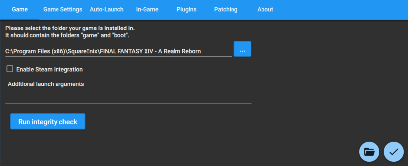

# XIVLauncher FAQ (Windows)

## Table of Contents

### Info

- [How do I disable autologin?](#q-how-do-i-disable-autologin)
- [Are XIVLauncher, Dalamud, and Dalamud Plugins safe to use?](#q-are-xivlauncher-dalamud-and-dalamud-plugins-safe-to-use)
- [How do I uninstall XIVLauncher?](#q-how-do-i-uninstall-xivlauncher)
- [Will plugins/XIVLauncher work on patch day?](#q-will-pluginsxivlauncher-work-on-patch-day)
- [Can I use XIVLauncher to log in early before a patch goes live?](#q-can-i-login-early-to-titlescreen-before-patch-live)
- [Where can I find my FFXIV installation?](#q-where-can-i-find-my-ffxiv-installation)
- [Can I repair my FFXIV installation?](#q-can-i-repair-my-ffxiv-installation)
- [How do I migrate FFXIV and/or XIVLauncher files from an old installation to a new one?](#q-how-do-i-migrate-ffxiv-andor-xivlauncher-files-from-an-old-installation-to-a-new-one)
- [What's the deal with Steam support?](#q-why-do-people-keep-asking-about-steam-so-much)

### Troubleshooting

- [I get an error saying XIVLauncher failed to check for updates when I open the program](#q-i-get-an-error-saying-xivlauncher-failed-to-check-for-updates-when-i-open-the-program)
- [Why doesn't the in-game addon \(Dalamud\) doesn't work and/or plugins don't display?](#q-how-come-the-in-game-addon-dalamud-doesnt-work-andor-plugins-dont-display)
- [How do I whitelist XIVLauncher and Dalamud so my antivirus leaves them alone?](#q-how-do-i-whitelist-xivlauncher-and-dalamud-so-my-antivirus-leaves-them-alone)
- [XIVLauncher isn't saving my new password / how do I clear my saved password?](#q-xivlauncher-isnt-saving-my-new-password--how-do-i-clear-my-saved-password)
- [I think XIVLauncher is giving me a Blue Screen of Death. What information would help narrow this down?](#q-i-think-xivlauncher-is-giving-me-a-blue-screen-of-death-what-information-would-help-narrow-this-down)
- [How can I fix crashes on startup?](#q-how-can-i-fix-crashes-on-startup)
- [The launcher shows a red world icon and an error message when trying to log in, and the official launcher doesn't open](#q-the-launcher-shows-a-red-world-icon-and-an-error-message-when-trying-to-log-in-and-the-official-launcher-doesnt-open)
- [The official launcher isn't working / XIVLauncher failed to check for updates / Patch files could not be verified](#q-the-official-launcher-isnt-working--xivlauncher-failed-to-check-for-updates--patch-files-could-not-be-verified)
- [How do I fix a version check error when trying to update FFXIV?](#q-how-do-i-fix-a-version-check-error-when-trying-to-update-ffxiv)

### Misc

- [Do not run XIVLauncher as admin](#do-not-run-xivlauncher-as-admin)\
- [XL Environment Variables](#xl-environment-variables)\
- [WTFast Config](#q-wtfast-config)
- [How to set an injection delay in RivaTuner/RTSS](#q-how-to-set-an-injection-delay-in-rivatunerrtss)
- [I updated my game with TexTools mods installed. How do I fix crashes?](#q-i-updated-my-game-with-textools-mods-installed-how-do-i-fix-crashes)

---

### Q: How do I disable autologin?

Keep the shift key held down while you open XIVLauncher. Keep it held down until the main window appears.

---

### Q: Are XIVLauncher, Dalamud, and Dalamud Plugins safe to use?

Yes! Here at Goatcorp, we take security extremely seriously. Using our software should never put you in a situation where another player can detect you're using third party modifications. At this time, we have no reason to believe that Square Enix does anything to detect client modifications in any form. Compare to using ReShade/GShade, ACT, Teamcraft, and other community projects. 

If you'd like to know more about XIVLauncher's security, [see this page.](security.md)

#### General Disclaimer

You shouldn't mention using XIVLauncher or plugins in-game, just like you shouldn't admit to using *any* third party modifications, as it is technically against the FFXIV Terms of Service. We have no reported cases of a user being banned for using XIVLauncher, Dalamud, or Dalamud plugins, but you should still exercise caution. All officially supported plugins go through code review to ensure that they are not exploiting the game or doing anything in such a manner that would result in your game client sending invalid data to the game servers. **We cannot endorse any unofficial plugins from third party plugin repositories. You use those at your own risk.**

Additionally, XIVLauncher is entirely a **hobby project**. We do this because it's fun to us, and not because we get paid for it. This means that we always try our best to be professional and responsive, but it also means that everything we do provide to you is on a "best effort" basis - maintaining software like this takes a lot of time and we're just human as well :)

If you have any questions about XIVLauncher, Dalamud, or Dalamud Plugins, please feel free to ask questions in our [Discord server](https://goat.place/). We are a primarily English-speaking community and support in other languages may be limited.

---

### Q: Where can I find my FFXIV installation?

(AKA: What does XIVLauncher mean by "game path"?)

FFXIV installs to a few different locations depending on whether you used the official installer or steam, when you installed it, and potentially if you installed the free trial or not. Here are some of the common paths.

Whatever you do, DO NOT SELECT THE `boot` OR `game` FOLDER. But if you already have a copy of FFXIV installed, you'll want the folder that contains them.

Official Launcher:

- `C:\Program Files (x86)\SquareEnix\FINAL FANTASY XIV - A Realm Reborn`

Steam:

- `C:\Program Files (x86)\Steam\steamapps\common\FINAL FANTASY XIV Online`
- `C:\Program Files (x86)\Steam\steamapps\common\FINAL FANTASY XIV - A Realm Reborn`

**NOTE**: If your steam library is on another drive, it will have a different, but similar structure.



---

### Q: Can I repair my FFXIV installation?

Yes! Right click `Log in` in XIVLauncher and select `Repair game files`.

**DO NOT USE THE REPAIR FEATURE IN THE OFFICIAL LAUNCHER!** It deletes your entire game installation and redownloads it.

---

### Q: How do I uninstall XIVLauncher?

You can uninstall XIVLauncher like any normal Windows program though the Control Panel or Settings app. If you want to purge any trace of it, check for and remove these folders.

Program installation and old versions:

- `%LocalAppData%\XIVLauncher`
- `%LocalAppData%\goatsoft` (if it exists)

Settings/plugins and other user config:

- `%AppData%\XIVLauncher`

---

### Q: How do I migrate FFXIV and/or XIVLauncher files from an old installation to a new one?

#### Copy a FFXIV Install

For the most part, FFXIV is portable. You just need to make sure you've installed DirectX as needed. I recommend installing the launcher with SE's installer first, and then replacing the files with a backup if you don't want to patch.

**NOTE**: You shouldn't do this if you had TexTools installed. Or at least, make sure to restore indexes/repair game first as it probably broke your client.

- Copy your user\character settings: `%USERPROFILE%\Documents\My Games\FINAL FANTASY XIV - A Realm Reborn`
- Copy XIVLauncher config (please reinstall your plugins): `%appdata%\XIVLauncher\pluginConfigs`
  - **NOTE**: do not copy other config or folders as those are unique to that particular computer. You should set them up per machine.

---

### Q: Will plugins/XIVLauncher work on patch day?

Please remember that many of the developers have school/jobs/both and live across a variety of time zones. Things will be updated when they can be. The notion that "XL could be gone at any time" still exists. **We have no clue how much work/time any possible patch may take and we can't give you any ETAs - it's impossible.** Please don't badger us about it, the more support we have to do on patch days, the less work we can do to fix things.

XIVLauncher:

- Users do not need to take any preemptive actions for XIVLauncher compatibility with a new patch.
- Unless SE decides to completely change how authentication or patch download/updating works, the launcher will work just fine on patch days.

Dalamud:

- Dalamud has an internal mechanism that checks the client version and a whitelisted compatibility file.
- If the client version does not match what's whitelisted, Dalamud will not load.
- Once Dalamud has been whitelisted, it will load the next time you launch with XIVLauncher. (We'll also make an announcement on Discord)
- Dalamud may or may not require updates to be made compatible with the current client. This ultimately depends on how much changed internally and we cannot provide any estimates on how long it may take to whitelist as compatible.

Plugins:

- Expect all plugins to stop working every patch.
- Once Dalamud has been whitelisted for a new patch, it will try to load plugins.
- It's entirely possible that a patch will be fine for Dalamud, but break a plugin. (If this happens, you'll want to disable/remove the plugin until it's updated)

---

### Q: Can I use XIVLauncher to log in early before a patch goes live?

No.

Like every patch maintenance, the lobby server will likely be taken offline as usual. Even assuming you get the patch downloaded and applied mid-maintenance, your authorization will almost assuredly be expired before things are back up.

You can make use of XL's "wait for maintenance to be over" features to sit and check for boot patches (no login required) and then prompt you to login for game patches as soon as they are generally available.

The "wait for maintenance to be over" feature can also check for servers to be live every ~15 seconds to get you logged in as soon as things are live.

As with any patch, **in-game addons will be automatically disabled until Dalamud is updated for new patch content**. Do not manually inject Dalamud as a startup application unless you'd like to crash your client!

---

### Q: What's the deal with Steam support?

People who bought FFXIV on Steam are required to link their Steam account to their Square Enix account in the official launcher. We have no way around this, and because of this, you are required to have Steam open if you have a Steam service account.

Your Steam installation also needs to be signed into the correct account.

If you want the Steam overlay on a non-Steam service account, you need to add XIVLauncher as a non-Steam game through Steam. If you want Steam to count hours for FFXIV, you can right-click it in your library, choose `Properties` and set `Launch Options` to `C:\Users\**YOUR USERNAME HERE**\AppData\Local\XIVLauncher\XIVLauncher.exe %command%`. 

---

### Q: I get an error saying XIVLauncher failed to check for updates when I open the program

There are a few different reasons that XIVLauncher will fail to open. Here are a few common ones.

#### XIVLauncher is being blocked by my antivirus/firewall

See the main [antivirus FAQ post](#q-how-do-i-whitelist-xivlauncher-and-dalamud-so-my-antivirus-leaves-them-alone) for information on how to whitelist XIVLauncher.

#### GitHub Rate Limits

If you've made a lot of queries to GitHub recently, it's possible they may have rate-limited you. This is usually a combined effort of XIVLauncher, Dalamud, Dalamud plugin updates, GShade, etc. all being done in rapid succession, which shouldn't happen under normal circumstances.

1. Try to visit [this page](https://api.github.com/rate_limit) and see if the post loads (or downloads a JSON file).
2. Look for `resources.core.remaining`. If it's 0, you've hit GitHub's rate limit.
3. If you've hit the limit, grab the timestamp number from resources.core.reset and convert the UTC timestamp into a human-readable date ([unixtimestamp.com](https://www.unixtimestamp.com/) works great for this).
4. Wait the alloted time before launching again, or the timeout period could be extended (if you absolutely need to get in game, use the official launcher during this time).

#### Not sure?

For the fastest support, head over to our [Discord server](https://goat.place/). and post into the XIVLauncher help channel with the error you're getting, a screenshot (if possible), and your `output.log` file (which can be found in `%AppData%\XIVLauncher` - use `f!faq logxl` in the Discord for more details there).

---

### Q: How come the in-game addon (Dalamud) doesn't work and/or plugins don't display?

Like many other game tools, Dalamud works by injecting into the FFXIV process and hooking DirectX. Occasionally, it conflicts with other tools or can't work because of them.

Some of the more common ones that may cause issues are:

- **Common Third-Party Antivirus**: See [this FAQ entry](#q-how-do-i-whitelist-xivlauncher-and-dalamud-so-my-antivirus-leaves-them-alone).
- **FRAPS**: Please make sure FRAPS is closed when opening FFXIV. It hooks DirectX for the FPS display and/or recording. You can open it for those features after the game is running.
- **Logitech GHub**: We don't know why this is a problematic application, but it is. This program may cause Dalamud to crash when exiting the game, leaving you on a black screen that's stuck and has to be closed uncleanly.
- **MacType**: MacType makes no changes to FFXIV because it doesn't use normal fonts anyways. Block it from hooking to FFXIV and you'll be fine.
- **MSI Afterburner**: Contains RTSS. See below.
- **OBS**: Some of the streaming modes involve hooking DirectX for better capture. This can cause plugins to render in streams or to not render at all. You may need to change your capture methods.
- **RivaTuner**/**RTSS**: Either blacklist FFXIV from automatic hooking or [set a RTSS load delay](#q-how-to-set-an-injection-delay-in-rivatunerrtss). RTSS can be used after Dalamud loads without issues.
- **SpecialK**: This also injects into DirectX and can mess things up for Dalamud's injection. It's not consistent, but you probably shouldn't use it unless you have a way of making it hook after Dalamud has loaded.

---

### Q: How do I whitelist XIVLauncher and Dalamud so my antivirus leaves them alone?

Please make exceptions (or whitelist) the following folders:

- `%LocalAppData%\XIVLauncher`
- `%AppData%\XIVLauncher`
- Your FFXIV game installation folder

You should also try to whitelist the following files if possible:

- `(your FFXIV installation)\game\ffxiv_dx11.exe`
- `%LocalAppData%\XIVLauncher\XIVLauncher.exe`
- `%LocalAppData%\XIVLauncher\app-X.Y.Z\XIVLauncher.exe`
  - NOTE: replace X.Y.Z with the latest version available. **This changes with every launcher update!**
- `%AppData%\XIVLauncher\addon\Hooks\W.X.Y.Z\Dalamud.Injector.exe`
  - NOTE: replace W.X.Y.Z with the latest version available. **This changes with every Dalamud update!**
- `%AppData%\XIVLauncher\addon\Hooks\W.X.Y.Z\DalamudCrashHandler.exe`
  - NOTE: replace X.Y.Z with the latest version available. **This changes with every launcher update!**
- `%AppData%\XIVLauncher\addon\Hooks\W.X.Y.Z\Dalamud.dll`
  - NOTE: replace W.X.Y.Z with the latest version available. **This changes with every Dalamud update!**
- `%AppData%\XIVLauncher\runtime`

Please also restart your computer afterwards.

#### Resetting Dalamud

You may also need to reset Dalamud (the plugin system). To reset Dalamud, remove the `%AppData%\XIVLauncher\addon\Hooks` folder.


#### Instructions for individual AV


<details><summary>Avast</summary>
<p>

---

<https://support.avast.com/en-ww/article/Antivirus-scan-exclusions>

---

</p>
</details>

<details><summary>AVG</summary>
<p>

---

<https://support.avg.com/SupportArticleView?l=en&urlname=AVG-Antivirus-scan-exclusions>

---

</p>
</details>

<details><summary>BitDefender</summary>
<p>

---

<https://www.bitdefender.com/consumer/support/answer/13427/>

**NOTE:** BitDefender users will also need to whitelist XIVLauncher's program files (`%LocalAppData%` stuff) through the [BitDefender firewall](https://www.bitdefender.com/consumer/support/answer/13425/). Otherwise, XIVLauncher will fail to check for updates, possibly fail to apply patches, and won't be able to download plugins.

---

</p>
</details>

<details><summary>Kaspersky Internet Security</summary>
<p>

---

<https://usa.kaspersky.com/blog/kaspersky-add-exclusion/11075/>

**NOTE:** Please add **file and folder** exclusion in the `Threats and Exclusions` section for the antivirus component. See the lists above for all details. You may also need to explicitly manager which AV scanners need to be disabled. [See this image for an example](https://user-images.githubusercontent.com/10376708/131000436-35097d20-f186-4942-ab43-73e51ff77609.png).\
**NOTE 2:** You may need to whitelist XIVLauncher's program files in the **[Kaspersky firewall](https://support.kaspersky.com/15163)** Application Rules as well. You'll know if you need to do this if you receive error messages related to checking for updates, applying patches, or downloading plugins and your logs indicate an access permission issue.

---

</p>
</details>

<details><summary>McAfee</summary>
<p>

---

<https://service.mcafee.com/webcenter/portal/cp/home/articleview?articleId=TS102056>

**NOTE:** McAfee doesn't allow you to whitelist folders. Instead, you'll need to whitelist files, which is more annoying and also version-specific. See the list above.

---

</p>
</details>

<details><summary>Norton</summary>
<p>

---

<https://support.norton.com/sp/en/us/home/current/solutions/v3672136>
Alternative link: <https://www.lifewire.com/exclude-files-from-norton-antivirus-scans-153348>

**NOTE:** You may also need to make exclusions from active detection or another similarly named feature.

---

</p>
</details>

<details><summary>Windows Defender</summary>
<p>

---

<https://support.microsoft.com/en-us/help/4028485/windows-10-add-an-exclusion-to-windows-security>

---

</p>
</details>

**PLEASE PROCEED WITH CAUTION**.\
If you're installing dev plugins, third-party plugins, or something outside of the normal `/xlplugins` method, we cannot be sure that the plugins will work, be undetected in-game, and not cause harm to your computer.

---

### Q: XIVLauncher isn't saving my new password / how do I clear my saved password?

XIVLauncher saves user credentials in the Windows Credential Manager. They will be appropriately labelled so you can find the exact one you want to edit/remove.

1. Open the Windows Credential Manager application. The fastest method is to just start typing its name in the start menu.
2. Select button for Windows Credentials
3. Scroll down until you see an entry like FINAL FANTASY XIV-username and expand the entry
4. Delete the entry. XIVLauncher will no longer be able to load it.
5. Now open XIVLauncher and try to login.

If you need more help, a basic guide can be found [here](https://pureinfotech.com/credential-manager-windows-10/).

---

### Q: I think XIVLauncher is giving me a Blue Screen of Death. What information would help narrow this down?

(NOTE: It's probably not XIVLauncher, but the following information will help us verify that)

1. What stop code are you getting?
2. What is the faulting application or driver?
3. When did this start happening for you?
4. Which plugins do you have installed? Does it still happen if you disable them and selectively re-enable them one by one?
5. Have you done a full uninstall of XIVLauncher and reinstall? (see a few posts above for details)

If unsure about some of those details or if the Windows Event Viewer doesn't tell you, [BlueScreenView](https://www.nirsoft.net/utils/blue_screen_view.html) can read the memory dump (please let the computer finish it without hitting the reset button while it dumps your memory to hard drive).

---

### Q: How can I fix crashes on startup?

Please try to install the VC Redist from Microsoft at [this link](https://github.com/abbodi1406/vcredist/releases/latest), as well as the .NET 4.8 Runtime found [here](https://dotnet.microsoft.com/download/dotnet-framework/thank-you/net48-web-installer).

If you are still facing issues, please join our [Discord server](https://goat.place/).

---

### Q: The launcher shows a red world icon and an error message when trying to log in, and the official launcher doesn't open

This is an issue with Square Enix servers that has been affecting players in the US for a while now, being caused by the login servers being hosted directly by SE in Japan and not taking care of their routes to players.

To remedy it, you can either wait a while and try again then, or set your VPN to Japan until you are on the title screen. Then you should be able to play normally without a VPN. DNS changes have also been said to help.

We can recommend [MUDFISH](https://mudfish.net) as a VPN for playing FFXIV as it's cheap and seems to work reliably. If you get errors when patching, we recommend [ProtonVPN](https://protonvpn.com/) or [Cloudflare WARP](https://1.1.1.1/).

To troubleshoot, you can ping `frontier.ffxiv.com`, SE's Japanese login server.

---

### Q: The official launcher isn't working / XIVLauncher failed to check for updates / Patch files could not be verified

Most likely, there's an issue with your network connection or the route it's taken to Square Enix's servers and/or GitHub. The only information XIVLauncher really gets from this is "something went wrong" though.

While this usually is a per-household kinda thing, there's no guarantee that multiple computers in the same location would get load balanced onto the same servers (which is why one computer worked and another didn't).

If you're sure this isn't a firewall issue or a rate limit, here are some things you can try.

- Reboot the computer
- Reboot the network equipment (modem and router)
- Try different DNS
  - Google offers 8.8.8.8 and 8.8.4.4
  - CloudFlare offers 1.1.1.1 and 1.0.0.1
  - Level3 offers 4.2.2.2 and 4.2.2.4
- Try a VPN
  - If you already connect using a VPN, try disconnecting it first
  - If you want to try a free VPN service, Cloudflare offers one at <https://1.1.1.1/> or you can try [ProtonVPN](https://protonvpn.com/) for more control.
  - If you want to try a paid VPN service (still no guarantee) we've recommended [MUDFISH](https://mudfish.net) in the past.
- Copy a working FFXIV install from another computer
  - The easiest method is to just copy the folder onto a large flash drive or external HDD.
  - If you're familiar with setting up Windows Sharing, you can also share the drive/folder from a working computer and copy it over your network.

---

### Q: How do I fix a version check error when trying to update FFXIV?

1. Go to `(your user folder)\Documents\My Games\FINAL FANTASY XIV - A Realm Reborn`.
2. Open the `FFXIV_BOOT.cfg` file in your text editor of choice.
3. Change `BootVersionCheckMode` to `1`.
4. Relaunch.

---

### Do not run XIVLauncher as admin

Yes, you've read that correctly! **Please do not run XIVLauncher as admin.** (And by extension, please do not run Dalamud manually as admin.)

You should also never let FFXIV run as admin as it **can and will result in your game configuration data becoming write-protected by your own user**. This can result in you being unable to save character config, hotbars, settings, and take screenshots, with no easy solution beyond trying to fix broken permissions or deleting all config and starting over. (SE does not handle file permissions very well!)

---

### XL Environment Variables

You can set `XL_PRERELEASE=true` for testing a new release of XIVLauncher if applicable. **If you set this on without knowing what it does, we will not help you if something breaks.**

Don't use the wine env var anymore. Just use the properly working Lutris scripts that work with SquirrelSetup.

**Support will not be provided if you are not on the current version of XL, Dalamud, and plugins. Use with caution as outdated versions will likely crash.**

---

### Q: WTFast Config


---

### Q: How to set an injection delay in RivaTuner/RTSS

1. Go to `C:\Program Files (x86)\RivaTuner Statistics Server\Profiles\\`.
2. Open the`ffxiv_dx11.exe.cfg` file in your text editor of choice.
3. Find the `[Hooking]` section and change 2 parameters there:

```text
InjectionDelay=15000
InjectionDelayTriggers=KERNEL32.dll,USER32.dll
```

If they are not present, add them.

---

### Q: I updated my game with TexTools mods installed. How do I fix crashes?

You'll know if you're affected by this because the official launcher will crash the game too. This issue is not caused by XIVLauncher.

Back up your mod files and [follow this FAQ entry to repair your game](#q-can-i-repair-my-ffxiv-installation). Please note your mods will be uninstalled.

---

Want to add a new FAQ entry? Please use the template below and PR to the main [FAQ repo](https://github.com/goatcorp/faq):

```md
### Q: Basic Title

(FAQ content)

---
```

Then add it to the Table of Contents using `- [Name / Title here](#anchor here)`.

---

[Return to the top](#table-of-contents)\
<a href="{{ site.github.baseurl }}/">Return to the main FAQ</a>
