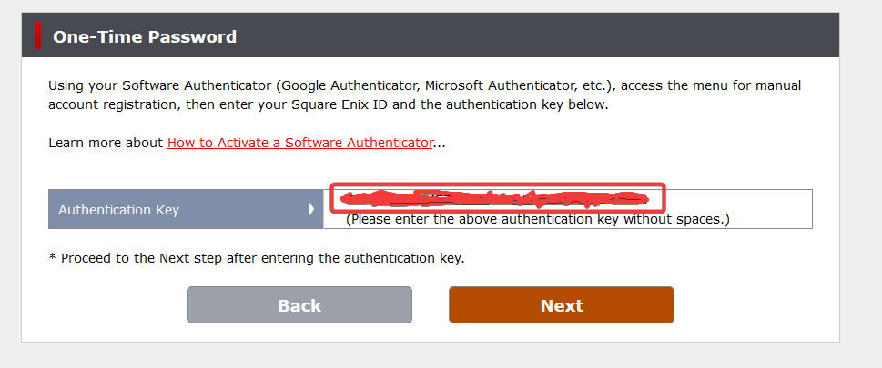

# XIVLauncher Physical Authentication

## Information

You can use a YubiKey hardware device alongside XIVLauncher to streamline the two-factor authentication (2FA) login process for FFXIV. Making it so you can  keep your 2FA enabled and login automatically with the click/touch of a button.

### What is a YubiKey?

A YubiKey is a physical security key that can make signing into online accounts more secure and seamless.

Some people use them for work/enterprise applications and some use them for securing personal accounts. In this case, we'll be using a YubiKey to login to Final Fantasy XIV. *I encourage you to do your research on the product beforehand, as, while it is useful, it is a relatively expensive device.*

### Background

I would open FFXIV multiple times a day which involved:

- Click XIVLauncher shortcut on my taskbar
- Open Authy or Google Authenticator
- Find my FFXIV account's one-time password
- Copy and paste (or type) that code into XIVLauncher
- Press 'Enter' or 'Confirm'

While this doesn't seem like a lot upfront, doing it multiple times a day almost daily for about a year makes you think about ways to speed it up. Especially during periods where the game would present users with login issues and the user is attempting to login repeatedly. I even thought about removing 2FA from my account, but decided against that because I wanted it to remain secure.

I wrote a script to interface with a YubiKey and have been using it to login to FFXIV for about a year and a half now. This is what that process looks like:

- Click shortcut on my taskbar
- Touch the YubiKey

And that's it!

After timing myself I realized I'd made my login process about 7x faster.

Let's show you how to set this up.

## Setup

### Step 0

First thing you'll need is a YubiKey device that has support for `OATH TOTP` (Time-based One Time Password). This is a standard that is used for two-factor Authentication (2FA) to generate the one-time six-digit passcodes you may be accustomed to from apps like Google Authenticator. Both the `YubiKey 5` and `YubiKey 4` series are compatible with `OATH TOTP`.


For this tutorial I'll be using a `YubiKey 5C NFC`. Once you have your YubiKey ready, go on to the next step.

### Step 1

You will need to enable 2FA on your Square Enix account. **If you already have 2FA enabled you will need to disable it, then follow the below steps. We'll be renabling it.**

Visit the MogStation website and then click on the `One-Time Password` link.


You will then be presented with the following page:


Click the `Software Authenticator` option

You will then see the following page:


Please click `Unable to Scan QR Code` and then copy down the code on the next page.



## **Do NOT share this QR Code or key with anyone. No one should EVER be asking for either of them. Treat the two like very important passwords and do NOT give them to *anyone*.**

This `Authentication Key` is what we will be using to create our authenticator 'account' on the YubiKey. This key can also be used in **multiple** applications, so you can (and should!) also use it (or the QR code on the previous screen) for Google Authenticator, Microsoft Authenticator, Authy, etc. Please keep this window open for the remainder of this setup tutorial.

**If you had 2FA enabled previously, please note you will need to replace the old entries in your authenticator apps with this new Authentication Key/QR Code.**

### Step 2

Open XIVLauncher and navigate to the `Settings` menu, then click `Enable XL Authenticator app/OTP macro support` *AND* `Enable YubiKey Authentication`


### Step 3

Next, please insert your YubiKey into your computer and pick **one** of the below options:

**OPTION A:** With XIVLauncher open, navigate to the `Settings` menu then click on the `Setup Auth` button.

Paste or type in your `Authentication Key` from MogStation into the field that pops up, then press `Enter`.

- Optionally, also toggle the `Require Touch?` checkbox if you'd like to have to touch your YubiKey before being logged in.


- Make sure to also add your `Authentication Key` to an application like `Authy`, `Microsfot Authenticator`, or your preferred software authenticator.

**OPTION B:** Download and install the [Yubico Authenticator](https://www.yubico.com/products/yubico-authenticator/) application, created by the makers of YubiKey. Click the `Add account` button, then fill out the fields like so:

- Issuer: XIVLauncher
- Account Name: FFXIV
- Secret Key: `Paste your Authentication Key here without the spaces`

Optionally enable `Require Touch`


Finally press `Add account`

You will then be presented with a screen displaying your newly added account and 2FA codes as they are generated. *If you made your YubiKey responsive to touch you may need to double click the newly made account; this will prompt you to touch your YubiKey and then you will see your 2FA code upon doing so.*


Afterwards add your `Authentication Key` to a separate software authenticator like `Google Authenticator`.

---

```text
Again, I'd recommend always having a backup. In the event you lose your security key you'd want to have another way to get into your account(s), and the same goes for if you lost access to a software authenticator you'd want to probably have another way to get into your account. Do your research on the software authenticators you use and also on Yubico. Keep track of your emergency recovery password and be aware of the steps you'd need to take if the worst case were to happen and your account was compromised.
```

### Step 4

Using the software authenticator of your choice, copy the generated 2FA code into the `MogStation webpage` that we left open to verify that your two-factor authentication is working properly and to finish the process.

With that you're fully setup and should be ready to login to Final Fantasy XIV with your security key!

## Now what?

### Let's attempt to login

Open XIVLauncher and login like normal until you are at presented with the following window:


(If you aren't seeing the above, make sure that the following settings are checked)


If your YubiKey is inserted, and you opted to not require touch, then you should be logged in automatically!

Otherwise, you will be presented with the following:


If you do as this prompt says and touch your YubiKey, you should then be logged in successfully!

- If you leave your YubiKey untouched for too long, you will see the following message:


```text
**NOTE:** If at any point you are presented with an error message stating that your one-time password (OTP) is invalid, please double check your `Authentication Key` and retry this tutorial starting from `Step 3`.
```

Have fun in Eorzea!

[Return to the top](#information)\
<a href="{{ site.github.baseurl }}/">Return to the main FAQ</a>
